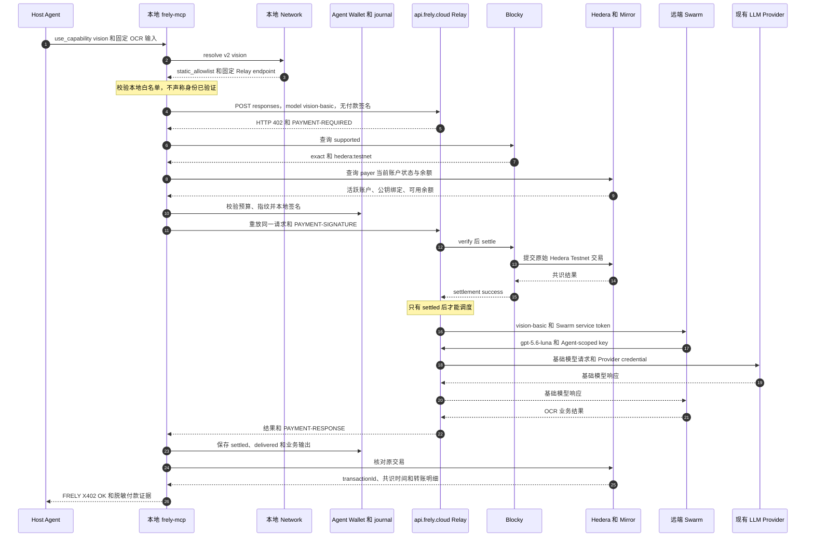

# 本地 Network 静态 Provider 与 Hedera x402 全链路 MVP 设计

## FXE2E-001 — 目标与完成口径

Status: Draft
Review level: L3
Source: 2026-09-12 用户确认的比赛 MVP 决策

本设计要跑通一条可举证的真实链路：Host Agent 调用本地 `frely-mcp`，本地
Network 服务返回固定的 Frely Relay 地址，MCP 使用本地 Agent Wallet 完成一次
Hedera Testnet x402 付款，Relay 在结算后调用 Swarm，Swarm 再经 Relay 调用现有
`gpt-5.6-luna` Provider，最终从固定图片中识别出 `FRELY X402 OK`。

本轮完成口径只能称为“静态 Provider 的真实付款全链路”。The Graph、ENS 和
ERC-8004 均不参与，不能把静态配置描述为市场发现或链上身份验证。编写本规格、
测试通过或部署完成也不等于全链路完成；只有真实结算、业务结果和无重复扣款的
回放证据同时具备，才通过验收。

## FXE2E-002 — 文档维护范围

Status: Draft
Review level: L3
Source: AGENTS.md 文档治理要求

本次维护只新增本设计规格，不改实现代码、现有架构基线、付款记录或任务完成
状态。维护顺序为：检查现有 MCP、Network 和 Relay 契约，冻结静态 Provider
接口，定义安全与失败边界，建立需求到验收的映射，再核对文档 ID、生命周期、
链接和术语。

本文使用仓库现有的持久 mdq profile。当前环境未发现 `mdq` 或独立的
`project-governance` 校验命令，因此采用同仓库受治理文档的 frontmatter 和结构化
记录格式；这不等于已通过外部 profile 校验。

## FXE2E-003 — 已确认的 MVP 边界

Status: Baseline
Review level: L3
Source: 用户逐项确认的范围与当前本地代码

| 组件 | 本轮职责 | 本轮不承担 |
| --- | --- | --- |
| Host Agent | 调用 `find_capability` 或 `use_capability` | 不指定 Provider 地址，不接触钱包密钥 |
| 本地 `frely-mcp` | 重查 Network、校验静态白名单、检查预算、签名、保存 payer journal、恢复和返回证据 | 不查询 Graph，不验证 ENS/ERC-8004，不代理服务端发现 |
| 本地 Network | 在 `127.0.0.1:13600` 提供 `resolve`，从受信本地配置返回唯一 Provider | 不持有钱包，不调用 Relay，不执行付款，不暴露公网服务 |
| `api.frely.cloud` Relay | API Key 准入、只为 `vision-basic` 报价、Blocky verify/settle、结算后调度、计量 | 不替 MCP 签名，不把普通模型改成付费模型 |
| Blocky | x402 v2 `exact` Facilitator，验证和结算 Hedera Testnet 付款 | 不选择 Provider，不保存 Frely 业务结果 |
| Swarm | 执行 `vision-basic` 工作流，以独立 Agent Key 调用基础模型 | 不接收用户钱包或调用者密钥 |
| 现有 Provider | 复用 `gpt-5.6-luna` 路由完成基础模型请求 | 不新增底层 Provider，不直接参与 x402 报价 |
| Mirror Node | 核对原交易、共识时间和账户转账 | 不作为业务成功证据 |

Network 与 MCP 都运行在用户本机。Relay、Swarm、Blocky 和基础模型 Provider
运行在远端。MCP 直接调用 Relay；Network 不在业务数据面上转发请求。

## FXE2E-004 — 固定身份与地址

Status: Baseline
Review level: L3
Source: 用户给定地址、用户确认账户与 2026-09-12 设计前只读核对

| 字段 | 固定值或约束 |
| --- | --- |
| Provider ID | `frely-vision-basic` |
| Relay API base | `https://api.frely.cloud/v1` |
| x402 resource | `https://api.frely.cloud/v1/responses` |
| 外部模型名 | `vision-basic` |
| Swarm 基础模型 | `gpt-5.6-luna` |
| x402 版本与方案 | v2、`exact` |
| 付款网络 | `hedera:testnet` |
| 资产 | HBAR，asset `0.0.0` |
| 金额 | `100000000` tinybar，即 1 HBAR |
| payer | `0.0.10386782` |
| payTo | `0.0.10403579` |
| Blocky fee payer | `0.0.7162784` |
| Facilitator | `https://api.testnet.blocky402.com` |
| 本地 Network origin | `http://127.0.0.1:13600` |
| 固定验收文本 | `FRELY X402 OK` |

设计前只读基线显示：`api.frely.cloud` 健康检查可达，版本为 `0.64.1`，release
为 `v0.65.24-20e832ac8ebf`，source SHA 为
`20e832ac8ebf6e4c712f70814414426e17904547`；`/v1/models` 返回六个现有模型，
尚未公开 `vision-basic`。一次 `gpt-5.6-luna` 普通请求已返回 200，但该结果只证明
现有 Relay 和 Provider 路径可用，不证明 x402、Swarm 或 HBAR 结算已接入。

设计前只读账户核对显示：payer 余额为 `672777702` tinybar，payTo 余额为
`1000000` tinybar，两个账户均为活跃 ECDSA 账户且未要求收款签名。余额是时变
状态，真实付款前必须重新查询，不能沿用本文快照做授权。

## FXE2E-005 — `resolve v2` 静态信任契约

Status: Planned
Review level: L3
Source: FXE2E-001 至 FXE2E-004；现有 `resolve v1` 身份语义

现有 `resolve v1` 响应强制包含 `ensName` 和
`identity.verified: true`，语义是经过链上身份验证。静态模式不能填造这些字段，
因此本轮冻结新的 v2 契约，不改变 v1 的既有含义。

```http
POST /v1/capabilities/resolve
Authorization: Bearer 本地 Network 专用密钥
Content-Type: application/json
```

请求固定为：

```json
{
  "schemaVersion": 2,
  "capabilities": ["vision"],
  "paymentNetwork": "hedera:testnet"
}
```

成功响应固定为：

```json
{
  "schemaVersion": 2,
  "requestedCapabilities": ["vision"],
  "provider": {
    "id": "frely-vision-basic",
    "endpoint": "https://api.frely.cloud/v1/responses",
    "protocol": "responses"
  },
  "resolution": {
    "source": "static_allowlist",
    "identityVerified": false
  },
  "payment": {
    "supportsX402": true,
    "network": "hedera:testnet"
  }
}
```

响应不得包含虚构的 ENS 名称、chain ID、registry 地址或 `verified: true`。Network
只接受 `vision` 和 `hedera:testnet`；其他能力返回
`CAPABILITY_NOT_SUPPORTED`。静态配置缺失、值不合法或与上述冻结值不一致时，
服务启动失败并报告 `STATIC_PROVIDER_NOT_CONFIGURED`，不退回 Graph 或另一个
Provider。

Network 服务从本地受信配置加载唯一 Provider，并固定绑定
`127.0.0.1:13600`。运行时不加载 `GRAPH_ENDPOINT`、RPC 或 registry 配置，不发出
Graph、ENS 或 ERC-8004 网络调用。

## FXE2E-006 — MCP 配置与信任边界

Status: Planned
Review level: L3
Source: 当前 `apps/frely-mcp/config.ts` 与静态模式决策

MCP 配置升级为明确的 `static-local` Network 模式。字段契约为：

| 字段 | 固定值或校验 |
| --- | --- |
| `schemaVersion` | `2` |
| `network.mode` | `static-local` |
| `network.baseUrl` | `http://127.0.0.1:13600` |
| `network.apiKeyRef` | `env:FRELY_NETWORK_API_KEY` |
| `relay.apiKeyRef` | `env:FRELY_RELAY_API_KEY` |
| `approvedProvider.id` | `frely-vision-basic` |
| `approvedProvider.endpoint` | `https://api.frely.cloud/v1/responses` |
| `walletDir` | 现有 Agent Wallet 目录的规范绝对路径 |
| `paymentConfigPath` | 现有批准付款 profile 的规范绝对路径 |
| `paymentRegistryPath` | 现有付款 registry 的规范绝对路径 |

三个路径由部署者写入本地配置，并保持现有目录、权限、registry 和 secret
reference 校验；规格不提供可能被误用的示例秘密路径。

安全规则固定如下：

1. `static-local` 只允许字面值 `http://127.0.0.1:13600`，不接受
   `localhost`、IPv6、局域网地址、其他端口、用户信息、查询串或片段。
2. Network 请求使用 `redirect: error`，10 秒超时和 1 MiB 响应上限。
3. MCP 只接受 v2 响应，且必须逐字段匹配 Provider ID、完整 endpoint、protocol、
   capability、payment network、`static_allowlist` 与
   `identityVerified: false`。
4. Relay 请求只发往冻结的完整 HTTPS resource，并拒绝重定向。Host Agent、
   Network 响应和 402 响应均不能覆盖 URL。
5. `FRELY_NETWORK_API_KEY` 只认证本地 Network；`FRELY_RELAY_API_KEY` 只认证
   远端 Relay。两者不得复用。
6. 已经出现在对话中的 Relay key 在真实测试前撤销并轮换；新 caller key、
   Swarm token 和 Swarm Agent key 分开授权、分开保存、最小权限。

静态模式不再要求 Sepolia chain ID 或 ERC-8004 registry。删除这些配置要求只适用
于 `static-local`，不能悄悄改变保留的 v1 链上验证模式。

## FXE2E-007 — MCP 工具行为

Status: Planned
Review level: L3
Source: 现有 stdio MCP 两工具与付款 journal 设计

`find_capability` 调用本地 Network 并返回静态 Provider 摘要。它不读取钱包、不
访问 Relay、不触发 402，也不使用“已验证身份”表述。

`use_capability` 每次新请求都重新调用本地 Network，再校验本地白名单。它构造
固定 `model: vision-basic`、`stream: false` 的 Responses 请求，并带唯一
`x-frely-request-id`。第一次请求带 Relay caller key，但不带
`PAYMENT-SIGNATURE`；收到 402 后才进入付款检查和本地签名。

签名前必须按顺序满足：

1. resolve 响应完全匹配静态白名单；
2. 402 是 x402 v2 `exact`，resource 与完整请求路径一致；
3. network、asset、amount、payTo、fee payer 和 timeout 与本地批准 profile 一致；
4. 工具预算和 profile 单次预算都精确允许 1 HBAR，不能自动提高；
5. requestId 尚未被不同请求指纹占用；
6. Agent Wallet 为 Ready，payer 与 signer 公钥对应；
7. payer 当前余额足够覆盖 1 HBAR 和本地保留额度；
8. Blocky 当前 `/supported` 仍支持 `exact` 与 `hedera:testnet`。

任一检查失败都必须在读取私钥、签名和结算前停止。付款重试必须复用相同
requestId、方法、完整 URL 和完全相同的请求 body；请求指纹覆盖 Provider、模型、
任务、图片输入和预算。

本地 payer journal 继续负责持久状态、原请求指纹、原交易引用、输出和恢复。
完全相同的已交付请求直接返回 journal 中保存的结果，不再调用 Relay。相同
requestId 但任一受保护字段变化时返回冲突，不付款、不调度。

## FXE2E-008 — Relay、Blocky 与 Swarm 行为

Status: Planned
Review level: L3
Source: Relay `feat/x402-resource-mvp@52e286d` 代码边界与用户确认

Relay 在现有 `api.frely.cloud` 部署中加入 model-scoped gate，只拦截
`POST /v1/responses` 且 `model` 为 `vision-basic` 的非流式请求。当前六个模型继续走
原路径，不返回 x402 报价。

服务端协议层复用官方 `x402ResourceServer`、`x402HTTPResourceServer` 和
`ExactHederaScheme`，Blocky 继续作为 Facilitator。固定环境约束为：

```text
FRELY_X402_RESOURCE_URL=https://api.frely.cloud/v1/responses
FRELY_X402_AMOUNT_ATOMIC=100000000
FRELY_X402_PAY_TO=0.0.10403579
FRELY_X402_FEE_PAYER=0.0.7162784
FRELY_X402_FACILITATOR_URL=https://api.testnet.blocky402.com
```

Relay 必须先完成 API Key 准入和模型范围检查，再发标准 402。收到付款头后，必须
验证 x402 版本、quote、resource、requestId 与 body hash，调用 Blocky verify 和
settle，并且只在结算成功后调度 Swarm。

Swarm 以私有服务 token 接收 `vision-basic`，再用独立、受限的 Agent-scoped
Frely key 调用 Relay 的 `gpt-5.6-luna` 路由。caller key、Swarm service token、
Swarm Agent key 和底层 Provider credential 是四个不同信任域，不在请求或日志中
互相透传。

本轮保留 Relay 现有的进程内 requestId 占位，不为比赛 MVP 新增数据库、分布式锁
或跨重启幂等。真实付款和回放验收期间不得重启 Relay；跨重启服务端去重明确属于
非目标。本地 MCP journal 仍须跨本地进程重启持久化。

## FXE2E-009 — 完整调用时序

Status: Planned
Review level: L3
Source: FXE2E-003 至 FXE2E-008



## FXE2E-010 — 状态、失败与恢复语义

Status: Planned
Review level: L3
Source: 现有 payer journal、Relay admission 与真实付款安全边界

| 情形 | 付款状态 | 业务调度 | 必须行为 |
| --- | --- | --- | --- |
| resolve、白名单或 402 不匹配 | `not_paid` | 否 | 立即拒绝，不读取私钥 |
| 预算、钱包或余额检查失败 | `not_paid` | 否 | 返回稳定错误，不提高额度 |
| 签名或 Blocky verify 被拒绝 | `not_paid` | 否 | 可在修正原问题后复用同一逻辑请求，不声称已付 |
| 调用 settle 后结果不明 | `unknown` | 否 | 只查询原 transaction，不创建新 requestId，不重发潜在付款 |
| settlement 成功、Swarm 或 Provider 失败 | `settled` | 已发生或失败 | 保留已付款事实；整条业务验收失败，不写成退款 |
| settlement 成功但客户端未收到输出 | `settled` 或 `unknown` | 可能已发生 | 查询原交易和已有 journal；无输出仍不通过验收 |
| 相同 requestId、相同指纹且已交付 | `delivered` | 否 | 返回已保存输出，不二次签名或结算 |
| 相同 requestId、不同指纹 | 保持原状态 | 否 | 返回冲突，不付款 |
| 六个现有模型发生回归 | 与本次付款分开记录 | 停止发布 | 回滚到记录的 release 和 source SHA |

一旦 Blocky settle 已被调用，超时或连接失败不能触发新的支付尝试。恢复只能围绕
原 transactionId、原 requestId 和原指纹进行。原交易无法确认时保持 `unknown`，
由用户决定后续处置。

## FXE2E-011 — 部署与回滚

Status: Planned
Review level: L3
Source: 用户选择复用 `api.frely.cloud` 与 MVP 不过度设计原则

部署复用当前 `api.frely.cloud` 的既有机制，不在本规格中臆测平台命令。执行者先
只读确认实际部署入口、当前 release、source SHA、健康检查和六模型列表，再进行
model-scoped canary：

1. 配置 Relay x402 gate，但仅作用于 `vision-basic`；
2. 配置私有 Swarm route、service token 和独立 Agent key；
3. 让 `/v1/models` 按既有产品规则暴露 `vision-basic`；
4. 先完成所有无费用 gate，再请求用户对一次 1 HBAR 付款作单独明确授权；
5. 付款后立即完成 Mirror、业务输出、回放和回归验收；
6. 任一既有模型回归，撤回 `vision-basic` route 和 x402 配置，恢复记录的基线版本。

回滚目标以部署前再次读取的实际 release 与 source SHA 为准。本文记录的
`v0.65.24-20e832ac8ebf` 只能作为设计快照，不能替代部署当天的回滚确认。

## FXE2E-012 — 分层验收规则

Status: Planned
Review level: L3
Source: 用户要求的真实全链路 spec 与证据边界

| Gate | 验收动作 | 通过证据 | 失败时状态 |
| --- | --- | --- | --- |
| G0 基线与回滚 | 记录远端健康、release、source SHA、六模型和实际回滚入口 | 带时间戳的脱敏响应与回滚目标 | 不部署 |
| G1 本地静态 resolve | 启动真实 loopback Network，调用 v2 resolve | 精确 `static_allowlist` 响应；网络观察无 Graph/RPC 调用 | 不启动 MCP 付款 |
| G2 endpoint 授权 | 对 Provider ID、URL、redirect、Network origin 做正反例 | 只接受两个冻结地址；篡改、重定向、私网远端均拒绝 | `PROVIDER_NOT_AUTHORIZED` |
| G3 远端 402 | 使用新 caller key 请求 `vision-basic`，不带付款头 | 标准 402；network、asset、amount、payTo、fee payer、resource 全部精确；Swarm 调度计数为零 | 不签名 |
| G4 钱包与预算预检 | 实时核对 payer、公钥、余额、Blocky supported 和 1 HBAR 上限 | 公开账户快照、报价对比和不含密钥的检查结果 | `not_paid` |
| G5 真实结算 | 获得单次授权后签名并提交原请求 | Blocky success；Mirror 确认原 transaction、Testnet、共识时间，payTo 净收 1 HBAR | `unknown` 或失败，绝不盲重试 |
| G6 业务结果 | 追踪 settled 后 Relay、Swarm、基础模型 Provider 调用 | 调度顺序、单次计数、`PAYMENT-RESPONSE` 和包含 `FRELY X402 OK` 的最终输出 | 全链路失败，保留付款事实 |
| G7 完全相同回放 | 再次调用相同 requestId 和完全相同输入 | 返回同一保存输出；签名、settle、Mirror 转账、Swarm 调度增量均为零 | 幂等验收失败 |
| G8 冲突回放 | 保持 requestId，改变 body、图片、预算或 Provider | 稳定冲突；无签名、付款或调度 | 安全验收失败 |
| G9 unknown 恢复 | 在测试双中模拟 settle 后超时；真实链仅在自然发生时处理 | 只查询原交易；无第二 transaction 或 requestId | 保持 `unknown` |
| G10 既有模型回归 | 检查 health、models，并调用至少一个现有模型 | 仍返回预期 200 和业务响应 | 立即回滚 |
| G11 秘密与证据 | 扫描日志、配置、bundle 和验收包 | 无 API key、私钥、原始签名、可广播交易或本地秘密路径 | 不交付证据包 |
| G12 声明边界 | 审阅 README、演示词和验收结论 | 只称静态 Provider 全链路，明确 Graph/ENS/ERC-8004 未参与 | 不宣称完成 |

G0 至 G4、G8 的测试双部分、G9 的模拟部分、G10 和 G11 均为无费用 gate。
它们全部通过后仍不得自动付款，必须再次向用户展示 payer、payTo、金额、网络和
resource，并取得对这一次 1 HBAR 交易的明确授权。

## FXE2E-013 — 固定验收输入与证据包

Status: Planned
Review level: L3
Source: 用户确认的 OCR 用例与秘密处理规则

验收使用一张稳定、公开可读取的静态图片，图中只包含高对比度文本
`FRELY X402 OK`。执行前把最终图片 URL 和内容 hash 写入本地验收记录；真实请求
及完全相同回放必须使用同一 URL、同一 hash、同一任务文本和同一序列化 body。

脱敏证据包至少包含：

- 执行时间、Network/MCP/Relay/Swarm 版本或 commit；
- 部署前后 health、models 和回归结果；
- v2 resolve 响应及 `static_allowlist` 声明；
- requestId、请求 body hash、quote 字段对比；
- 公开 transactionId、Mirror 链接、共识时间和账户转账明细；
- Blocky 结算结果摘要与 `PAYMENT-RESPONSE` 摘要；
- Relay、Swarm 和基础模型单次调用计数或同一 trace 的脱敏记录；
- 首次输出和相同回放输出，均包含 `FRELY X402 OK`；
- 第二次签名、settle、链上转账和业务调度增量为零的证据；
- G0 至 G12 的逐项结果和未通过原因。

证据包不得包含任何 API key、私钥、secret reference 的实际值、原始付款签名、
可广播交易字节、内部完整 header 或本地秘密文件路径。公开账户 ID、transactionId
和 Mirror 链接可以保留。

## FXE2E-014 — 非目标

Status: Baseline
Review level: L3
Source: 比赛 MVP 不过度设计原则

本轮明确不做：

- The Graph 查询、候选排序或动态 Provider 市场；
- ENS、ERC-8004 注册或身份验证；
- Network 服务远程部署或远程 MCP；
- Hedera Mainnet、多资产、多 Provider、多钱包或自动切换；
- Relay 跨重启持久幂等、数据库、分布式锁、高可用或负载测试；
- 自动退款、自动充值、额度自动提升或 settle 未知时自动重发；
- 重写现有六模型的认证、计费或路由；
- npm 发布、合并、推送或正式生产发布，除非另行授权。

## FXE2E-015 — 最终 Definition of Done

Status: Planned
Review level: L3
Source: FXE2E-012 与用户确认的单次真实付款目标

只有同时满足以下条件，任务才可标记为完成：

1. G0 至 G4 的所有无费用 gate 通过；
2. 用户在看到最终付款摘要后，单独授权一次 1 HBAR Testnet 交易；
3. Mirror 确认唯一原交易从 payer 向 payTo 支付精确 1 HBAR；
4. Relay 只在 settled 后调用 Swarm，Swarm 通过 Relay 复用
   `gpt-5.6-luna` Provider；
5. 最终业务输出包含精确文本 `FRELY X402 OK`；
6. 完全相同回放返回已保存结果，且没有第二次签名、结算、链上转账或业务调度；
7. 既有健康检查、模型列表和至少一个普通模型请求没有回归；
8. 脱敏证据包完整，G0 至 G12 均有可核对结果；
9. 结论明确写出 The Graph、ENS 和 ERC-8004 未参与。

任何一项缺失都只能报告对应层已通过，不能报告“全链路完成”。用户审阅并确认
本设计后，再基于它编写 MVP 实施计划；本规格本身不授权部署或真实付款。
